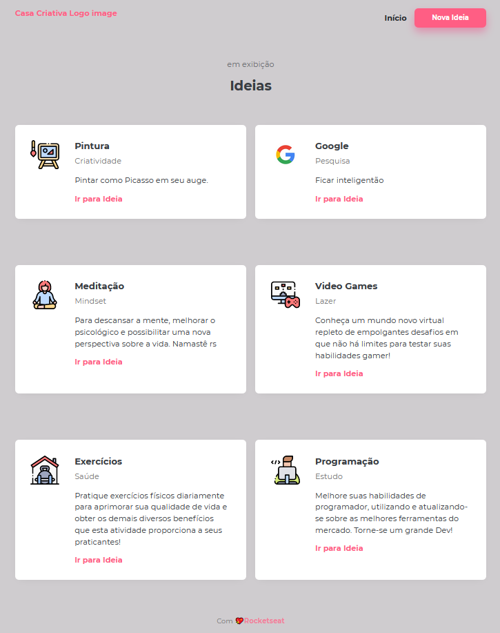

<h1 align="center">
    
</h1>

<h2 align="center">
    <b>Ideias para se fazer em casa no tédio do isolamento 😑</b> <br>
</h2>

## Introdução

Aplicação divertida para cadastro de ideias e hobbys para se fazer durante o isolamento.

## Executando

Na pasta do projeto pelo terminal, execute:
``` bash
npm run dev
```
Aplicação roda na porta [3000](https://localhost:3000)

### Página principal

<div align="center">
    
</div>

### Modal

<div align="center">
    
</div>

### Página de ideias

<div align="center">
    
</div>


#### Instrutor [Maik Brito](https://app.rocketseat.com.br/me/maykbrito)

Realizado na [WorkShop Dev](https://www.youtube.com/watch?v=cprMYC8PCVY&list=PL85ITvJ7FLohGTWaE_p0J6B-TLmQbN4ka) - [RocketSeat](https://rocketseat.com.br)

Feito com [Node.js][1], Express, Nunjuncks e SQLite.

<div align="center">
    
</div>
    
[1]: https://nodejs.org/en/
