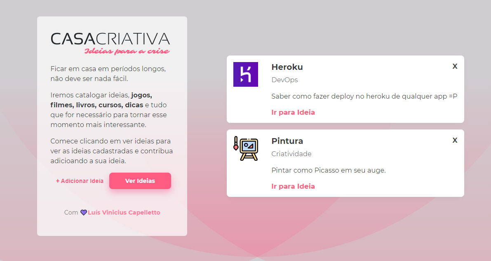
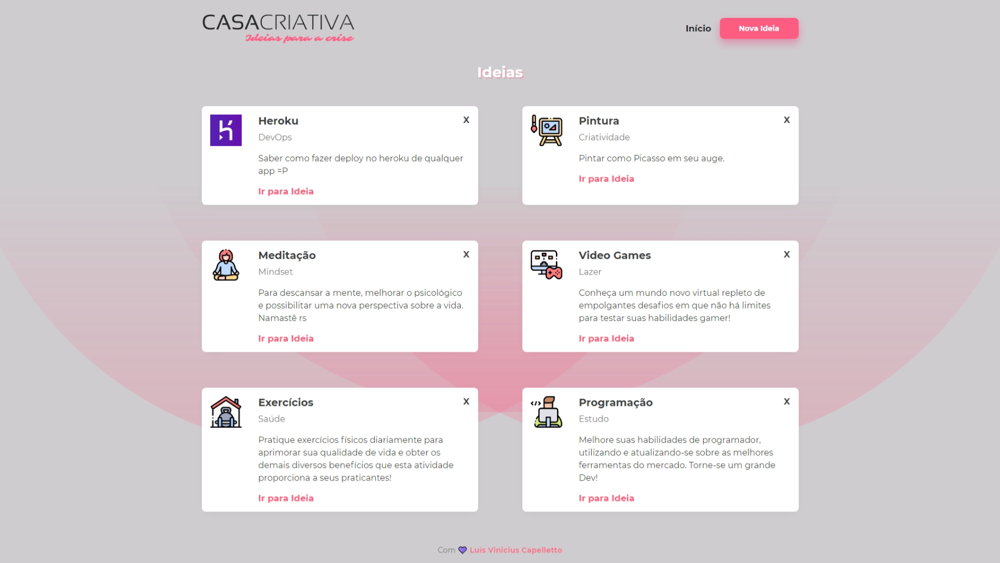

<h1 align="center">
    
</h1>

<h2 align="center">
    <b>Ideias para se fazer em casa no tédio do isolamento..</b> <br>
</h2>

## Projeto

Aplicação divertida para cadastro de ideias e hobbys para se fazer durante o isolamento.
Acesse em: [Casa Criativa](https://capelaum-casa-criativa.herokuapp.com)

## Executando

Na pasta raiz do projeto pelo terminal, execute:
``` bash
npm run dev
```
Aplicação roda na porta [3000](https://localhost:3000)

## Layout 

<div align="center">
    <h3>Página principal</h3>
    
</div>

<div align="center">
    <h3>Modal</h3>
    
</div>

<div align="center">
    <h3>Página de ideias</h3>
    
</div>

### Tecnologias

- Feito com [Node.js][1], [Express][2], [Nunjuncks][3] e [SQLite][4].

### Créditos 

- Instrutor [Maik Brito](https://app.rocketseat.com.br/me/maykbrito)

- Realizado na [WorkShop Dev](https://www.youtube.com/watch?v=cprMYC8PCVY&list=PL85ITvJ7FLohGTWaE_p0J6B-TLmQbN4ka) - [RocketSeat](https://rocketseat.com.br)

[1]: https://nodejs.org/en
[2]: https://expressjs.com/pt-br
[3]: https://mozilla.github.io/nunjucks
[4]: https://www.sqlite.org/index.html
