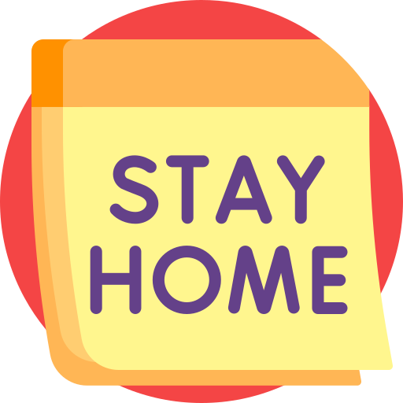

<h1 align="center"></h1>

<h2 align="center">
     
    <b>Ideias para se fazer em casa na quarentena</b>   
    RocketSeat - WorkShop Dev
</h2>

:dart: The main goal is to learn more about [Node.js][1], [React][2], JavaScript and also use Express, Nunjuncks and SQLite.
 
Icon made by 
<a href="https://www.flaticon.com/authors/freepik" title="Freepik">Freepik</a> from 
<a href="https://www.flaticon.com/" title="Flaticon"> www.flaticon.com</a>
    
[1]: https://nodejs.org/en/
[2]: https://reactjs.org/

